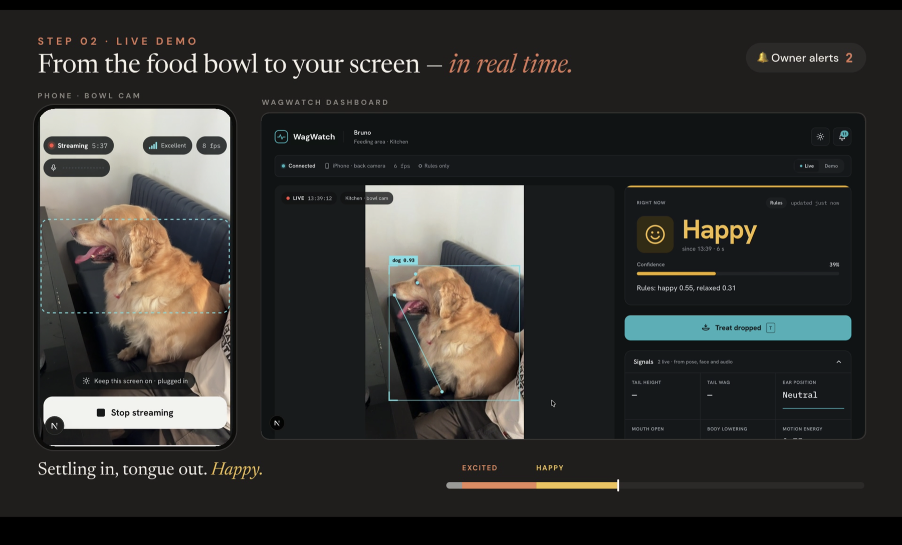
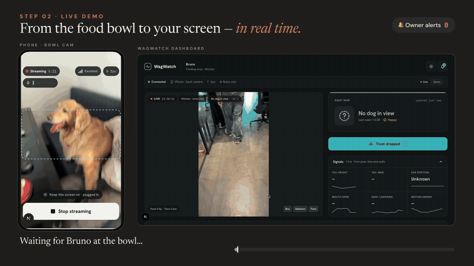
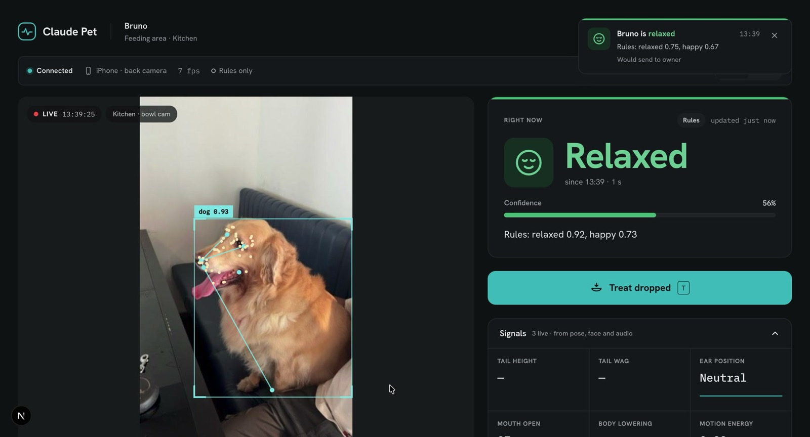
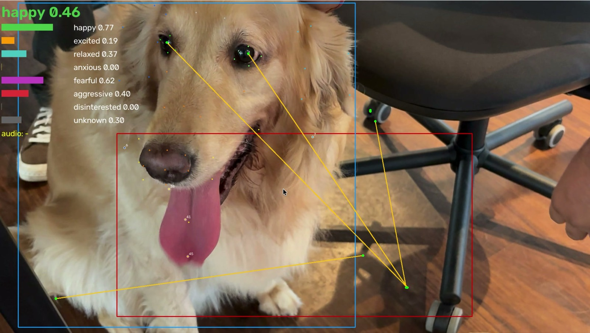
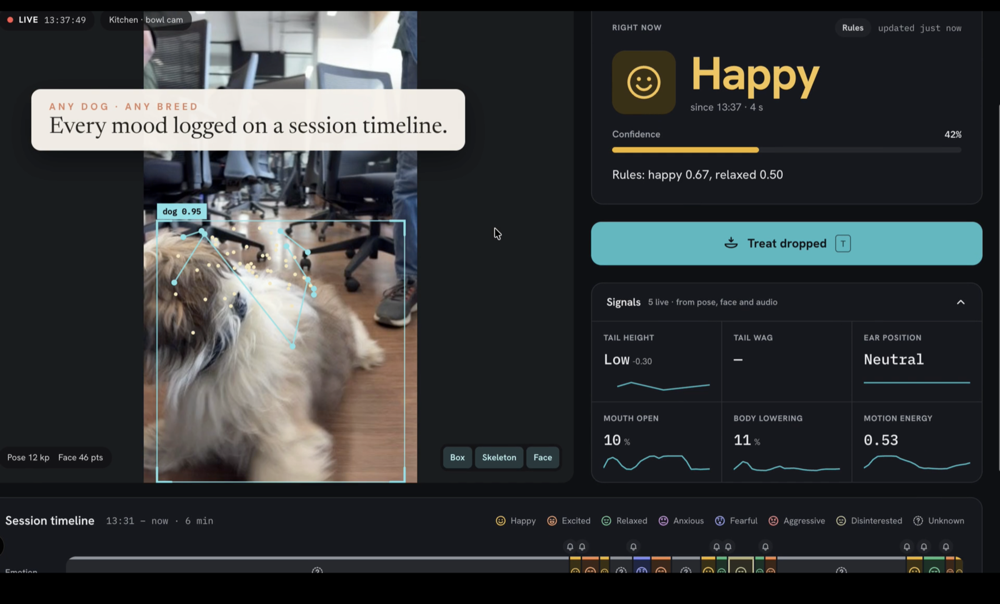
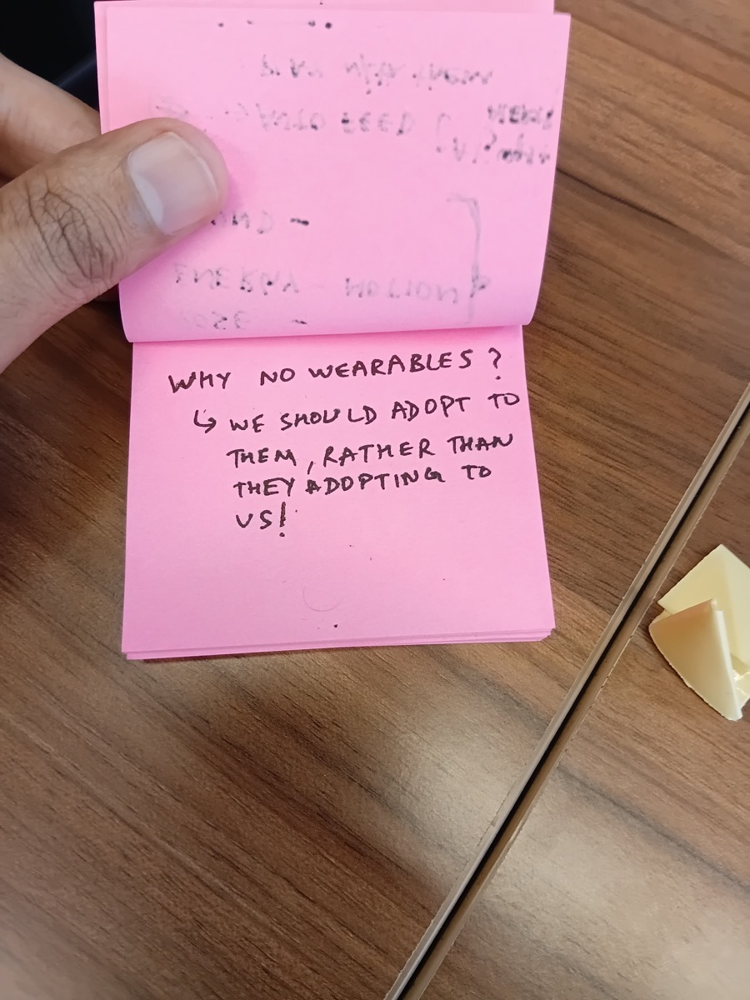
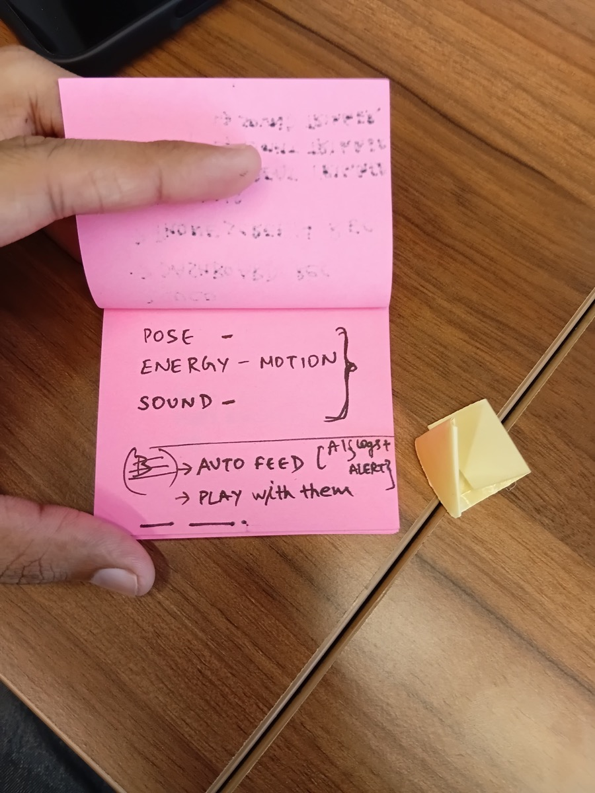
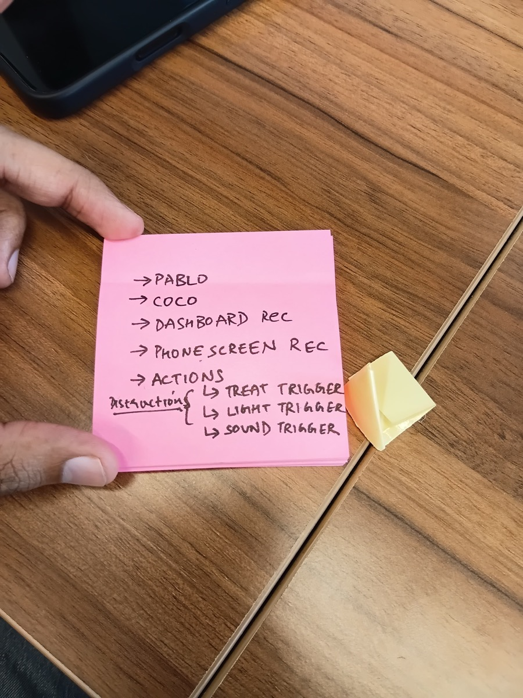
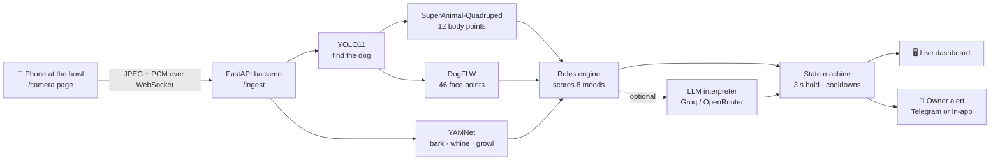

<div align="center">

  

  <h1>WagWatch</h1>
  <p><sub>repo: Behind the Barks</sub></p>
  <p><b>Know how your dog feels, live, from any phone.</b></p>

  <a href="./assets/WagWatch_Showcase_90s.mp4"></a>
  
  

  <p><a href="#why">Why</a> · <a href="#see-it-work">Demo</a> · <a href="#photos">Photos</a> · <a href="#new-capability">New capability</a> · <a href="#how-it-works">How it works</a> · <a href="#run-it">Run it</a> · <a href="#team">Team</a></p>

</div>

## Why

**Dogs can't tell us how they feel, and we usually find out too late.** They spend hours home alone. Worry shows up in their ears, tail, posture and whines, and nobody is there to see it. By the time we notice a chewed door or a skipped meal, the bad day already happened.

WagWatch puts an old phone next to the food bowl. It watches from a distance, with no collar or gadget on the dog. When the dog's mood really changes, the owner gets a short note saying what changed and why.

> *"Why no wearables? We should adapt to them, rather than they adapting to us!"*
> <sub>our handwritten takeaway, photographed <a href="#photos">below</a></sub>

## See it work

**The problem:** a dog's mood is written in its body and voice, but nobody is watching.

<a href="./assets/WagWatch_Showcase_90s.mp4"></a>
<p align="center"><sub>16-second loop from the live run. Click for the full 90-second video.</sub></p>

<div align="center">
  <a href="./assets/WagWatch_Showcase_90s.mp4"></a>
</div>

**What just happened**

1. **Input:** an iPhone at the bowl opens a web link and streams camera and mic. No app to install.
2. **What the models did:** they found the dog, tracked 12 body points and 46 face points, listened for barks and whines, then scored all 8 moods.
3. **Result:** the dashboard went *No dog in view → Excited → Happy* as Bruno arrived and settled. It also queued an owner alert.

## Photos

> [!IMPORTANT]
> Photos needed: **team photo**, **you with your build**. Add them to `./assets` and attach them to the GitHub Release for this submission.

<table>
  <tr>
    <td align="center" width="33%"><br><sub><b>Finished build:</b> phone at the bowl, dashboard live</sub></td>
    <td align="center" width="33%"><br><sub><b>Close-up, UI:</b> Relaxed at 56%, alert toast</sub></td>
    <td align="center" width="33%"><br><sub><b>Close-up, model view:</b> boxes, pose and live scores</sub></td>
  </tr>
  <tr>
    <td align="center"><br><sub><b>Close-up:</b> a second dog, another breed, same pipeline</sub></td>
    <td align="center"><br><sub><b>Handwritten note:</b> our takeaway</sub></td>
    <td align="center"><br><sub><b>Behind the scenes:</b> the first signal sketch</sub></td>
  </tr>
  <tr>
    <td align="center"><br><sub><b>Behind the scenes:</b> demo shot list</sub></td>
    <td align="center"><sub><b>Photo needed:</b><br>team photo</sub></td>
    <td align="center"><sub><b>Photo needed:</b><br>you with your build</sub></td>
  </tr>
</table>

<details>
<summary>More: screen recording and UI sketches</summary>

- Full 90-second screen recording: [`assets/WagWatch_Showcase_90s.mp4`](./assets/WagWatch_Showcase_90s.mp4)
- All UI screens, designed before any code was written (desktop, mobile, camera states, alerts): [`ui/screens/`](./ui/screens/)
- Planning sticky notes: [why/how/what](./assets/bts-sketch-1.jpg), [trigger → computer → actor](./assets/bts-sketch-5.jpg)

</details>

## New capability

**Long-horizon agentic building: two people shipped a 54-commit, 381-test, multimodal system in two days.** Claude Opus in Claude Code did the building, working from a shared spec.

Each person drove their own Claude session through a numbered plan: [`PROMPTS-DATA.md`](./PROMPTS-DATA.md) for vision and audio, [`PROMPTS-WEB.md`](./PROMPTS-WEB.md) for the backend and dashboard, 27 steps in total. [`CLAUDE.md`](./CLAUDE.md) holds the JSON contracts both sessions obeyed. That is why the two halves plugged together on the first evening, with no rewrite.

| What it took | How we know it held |
| --- | --- |
| Keeping one spec across 27 steps and two parallel sessions | Both sides built to [`backend/contracts.py`](./backend/contracts.py). The generated TS types are checked by [`tests/web/test_ts_types.py`](./tests/web/test_ts_types.py) |
| Wiring 4 pretrained models it had never seen together (YOLO, SuperAnimal pose, DogFLW face, YAMNet) | End to end in [`backend/pipeline.py`](./backend/pipeline.py) and [`backend/vision/`](./backend/vision/), covered by [`tests/data/`](./tests/data/) |
| Writing the tests alongside the code, not after | 381 tests across [`tests/data`](./tests/data/) and [`tests/web`](./tests/web/), all passing |

Where the model's work shows most:

- Contract-first split: [`CLAUDE.md` › JSON contracts](./CLAUDE.md#json-contracts) and [`backend/contracts.py`](./backend/contracts.py)
- The step-by-step prompts both of us ran: [`PROMPTS-DATA.md`](./PROMPTS-DATA.md), [`PROMPTS-WEB.md`](./PROMPTS-WEB.md)
- Mood scoring from pose, face and sound: [`backend/fusion/rules.py`](./backend/fusion/rules.py), weights in [`config.yaml`](./config.yaml)

> [!NOTE]
> An optional runtime LLM interpreter is wired up: [`backend/fusion/prompts.py#L13`](./backend/fusion/prompts.py#L13) and [`llm_interpreter.py#L56`](./backend/fusion/llm_interpreter.py#L56). It reads the frame and signals through Groq or OpenRouter. It was **not on during the live demo**: every mood you see came from the rules engine (the "Rules only" chip in the photos).

## How it works

A phone opens our `/camera` page and streams video frames and audio to the backend. Pretrained models find the dog and read its body, face and sounds. A rules engine turns those signals into one of eight moods, which must hold for 3 seconds before it counts. The dashboard updates live, and the owner is notified on real changes only, with a 60-second cooldown per mood.



| Layer | Tool | Why |
| --- | --- | --- |
| Camera | Phone browser, `getUserMedia` | Any phone works from a link, with no app |
| Detection | Ultralytics YOLO11 | Pretrained COCO "dog" class, fast on a laptop |
| Body pose | DeepLabCut SuperAnimal-Quadruped | Pretrained on many breeds; gives tail, back and legs |
| Face | DogFLW 46-point model | Ears, eyes and mouth, the main mood cues |
| Sound | YAMNet (AudioSet) | Tells barks, yips, whimpers and growls apart out of the box |
| Mood | Rules in `config.yaml` | Readable, tunable, and works offline |
| Backend | Python 3.11, FastAPI, WebSocket | One process for ingest, fan-out and MJPEG video |
| Dashboard | Next.js 16, React, Tailwind v4 | Canvas overlay, timeline and alerts; works on mobile |
| Alerts | Telegram Bot API, or in-dashboard | No native app needed |

## Run it

**Works live today**

- ✅ Any phone as the camera and mic, over an HTTPS tunnel
- ✅ Dog detection, 12-point pose and 46-point face tracking in real time (~6–8 fps)
- ✅ Bark, yip, whimper, growl and howl detection
- ✅ All 8 moods scored, with a persistence check and cooldowns
- ✅ Dashboard: live overlay, mood card, signals, session timeline, "treat dropped" button
- ✅ Owner alerts in the dashboard ("would send to owner")
- ✅ Offline demo mode that replays 7 pre-recorded clips with zero network

**Mocked or not yet proven**

- ⚠️ LLM interpreter: code and tests exist, but it was off in the live demo
- ⚠️ Telegram alerts: adapter plus [`scripts/telegram_test.py`](./scripts/telegram_test.py); the demo ran in dashboard-only mode
- ⚠️ Mood accuracy: on the 7 fallback clips, the dominant mood matched our hand label on **4 of 7** ([`manifest.json`](./data/fallback/manifest.json))
- ⚠️ Fallback clips are licensed stock footage, not our own dog ([`SOURCES.md`](./data/fallback/SOURCES.md))

**Fastest path: offline, no camera, no keys**

```bash
git clone https://github.com/ComputerTech99/Behind_The_Barks && cd Behind_The_Barks
python3.11 -m venv .venv && source .venv/bin/activate
pip install -r requirements-web.txt
cd frontend && npm install && cd ..
# config.yaml: set  web.pipeline: mock  (the committed value, real, needs the ML stack)
make demo                           # terminal 1: DEMO_MODE=1 backend on :8000
make dev-frontend                   # terminal 2 → http://localhost:3000, then flip to Demo
```

| Variable | What it does | Needed? |
| --- | --- | --- |
| `LLM_PROVIDER` | `groq` or `openrouter` | Optional |
| `LLM_API_KEY` | Key for that provider | Optional |
| `LLM_BASE_URL` | OpenAI-compatible endpoint | Optional |
| `LLM_MODEL` | Any model name from the provider | Optional |
| `LLM_VISION` | `1` sends the frame, `0` sends text only | Optional |
| `TELEGRAM_BOT_TOKEN`, `TELEGRAM_CHAT_ID` | Owner alerts on Telegram | Optional |
| `NOTIFY_MODE` | `telegram` or `dashboard_only` | Optional |
| `DEMO_MODE` | `1` replays cached clips offline | Optional |

Copy `.env.example` to `.env`. Anything left blank degrades gracefully to rules-only moods and dashboard-only alerts.

<details>
<summary>Live phone camera with the real vision pipeline</summary>

```bash
pip install -r requirements-data.txt          # heavy ML stack, 5–10 min
python scripts/check_env.py                   # torch/MPS, tensorflow, ultralytics import check
python scripts/fetch_face_model.py            # downloads the DogFLW model once
# config.yaml: data.source.type: browser, web.pipeline: real
make dev-backend && make dev-frontend
cloudflared tunnel --url http://localhost:8000   # backend → https://X.trycloudflare.com
cloudflared tunnel --url http://localhost:3000   # frontend → https://Y.trycloudflare.com
```

On the phone, open `https://Y.trycloudflare.com/camera?backend=https://X.trycloudflare.com`. Allow camera and mic, then point it at the bowl. The full runbook and failure drills are in [`docs/DEMO_RUNBOOK.md`](./docs/DEMO_RUNBOOK.md).

Python 3.11 or 3.12 only (TensorFlow has no 3.13+ wheels yet). Don't leave `web.pipeline: real` as your default: `DEMO_MODE` does not override it.

</details>

<details>
<summary>Tests</summary>

```bash
pytest                      # 381 passed in ~86 s (needs both requirement sets installed)
make test-frontend          # vitest + typecheck + lint
```

</details>

<details>
<summary>Credits and licence</summary>

Pretrained work: Ultralytics YOLO, DeepLabCut SuperAnimal-Quadruped, [`hugocornellier/dog-face-landmarks`](https://huggingface.co/hugocornellier/dog-face-landmarks) (DogFLW, **CC BY-NC 4.0, non-commercial**), and Google YAMNet / AudioSet. Fallback clips come from Pexels, Pixabay, ESC-50 and AudioSet, with the source and licence of each file in [`data/fallback/SOURCES.md`](./data/fallback/SOURCES.md).

No licence has been chosen for this repo yet, so all rights are reserved.

</details>

## Team

Built at **Claude Community Bangalore · Opus Build Day**, Creature Commons, 26–27 September 2026.

<table>
  <tr>
    <td align="center" width="200"><a href="https://github.com/ComputerTech99"><br><b>Ojash Gupta</b></a><br><sub>Data: vision, audio, rules, fallback clips</sub></td>
    <td align="center" width="200"><b>Amit</b><br><sub>Web: backend, dashboard, phone camera, alerts</sub></td>
  </tr>
</table>

## Rubric map

| Criterion | Evidence | Proof |
| --- | --- | --- |
| **New Capability** | Claude Opus built a 54-commit, 381-test multimodal system in 2 days, across two parallel sessions tied together by one spec | [New capability](#new-capability) |
| **It Works** | Ran live on a real dog from an iPhone; video, photos and an honest works/mocked list | [See it work](#see-it-work) · [Photos](#photos) · [Run it](#run-it) |
| **Keep or Share** | Any dog owner who leaves the house can reuse an old phone, with nothing on the dog | [Why](#why) |
| **Clarity of Demo** | One-line problem, a 16 s GIF on the first screen, and "No dog → Excited → Happy" in 3 steps | [See it work](#see-it-work) |
