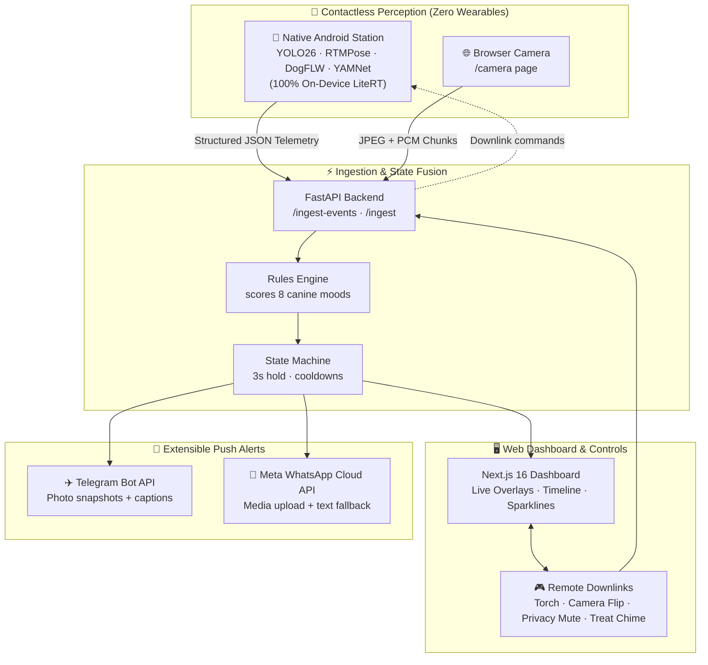

<div align="center">

  

  <h1>WagWatch</h1>
  <p><sub>repo: Behind the Barks</sub></p>
  <p><b>Know how your dog feels, live, from any phone.</b></p>

  <a href="./assets/WagWatch_Showcase_90s.mp4"></a>
  <a href="https://github.com/07AMIT10/BehindTheBarks/actions"></a>
  <a href="https://github.com/07AMIT10/BehindTheBarks/releases/tag/v1.0.0-android"></a>
  

  <p><a href="#why">Why</a> · <a href="#see-it-work">Demo</a> · <a href="#photos">Photos</a> · <a href="./docs/USER_ONBOARDING_GUIDE.md"><b>User Onboarding Guide</b></a> · <a href="https://github.com/07AMIT10/BehindTheBarks/releases/tag/v1.0.0-android"><b>Download APK</b></a> · <a href="#how-it-works">Architecture</a> · <a href="#run-it">Run it</a></p>

</div>

> 📱 **Just installed the app?** Check out the step-by-step [User Onboarding & Station Setup Guide](./docs/USER_ONBOARDING_GUIDE.md) to set up your camera station in 3 minutes!

## Why

**Dogs can't tell us how they feel, and we usually find out too late.** They spend hours home alone. Worry shows up in their ears, tail, posture and whines, and nobody is there to see it. By the time we notice a chewed door or a skipped meal, the bad day already happened.

WagWatch puts an old phone next to the food bowl. It watches from a distance, with no collar or gadget on the dog. When the dog's mood really changes, the owner gets a short note saying what changed and why.

> *"Why no wearables? We should adapt to them, rather than they adapting to us!"*
> <sub>our handwritten takeaway, photographed <a href="#photos">below</a></sub>

## See it work

**The problem:** a dog's mood is written in its body and voice, but nobody is watching.

<a href="./assets/WagWatch_Showcase_90s.mp4"></a>
<p align="center"><sub>16-second loop from the live run. Click for the full 90-second video.</sub></p>

<div align="center">
  <a href="https://drive.google.com/file/d/1hFtcWJiUTKwAFoDsJZX7ldm5-II10bWf/view?usp=drive_link"></a>
</div>

**What just happened**

1. **Input:** an iPhone at the bowl opens a web link and streams camera and mic. No app to install.
2. **What the models did:** they found the dog, tracked 12 body points and 46 face points, listened for barks and whines, then scored all 8 moods.
3. **Result:** the dashboard went *No dog in view → Excited → Happy* as Bruno arrived and settled. It also queued an owner alert.

## Photos

<table>
  <tr>
    <td align="center" width="33%"><br><sub><b>Finished build:</b> phone at the bowl, dashboard live</sub></td>
    <td align="center" width="33%"><br><sub><b>Close-up, UI:</b> Relaxed at 56%, alert toast</sub></td>
    <td align="center" width="33%"><br><sub><b>Close-up, model view:</b> boxes, pose and live scores</sub></td>
  </tr>
  <tr>
    <td align="center"><br><sub><b>Close-up:</b> a second dog, another breed, same pipeline</sub></td>
    <td align="center"><br><sub><b>Handwritten note:</b> our takeaway</sub></td>
    <td align="center"><br><sub><b>Behind the scenes:</b> the first signal sketch</sub></td>
  </tr>
  <tr>
    <td align="center"><br><sub><b>Behind the scenes:</b> demo shot list</sub></td>
  </tr>
</table>

<details>
<summary>More: screen recording and UI sketches</summary>

- Full 90-second screen recording: [`assets/WagWatch_Showcase_90s.mp4`](./assets/WagWatch_Showcase_90s.mp4)
- All UI screens, designed before any code was written (desktop, mobile, camera states, alerts): [`ui/screens/`](./ui/screens/)
- Planning sticky notes: [why/how/what](./assets/bts-sketch-1.jpg), [trigger → computer → actor](./assets/bts-sketch-5.jpg)

</details>

## New capability

**Long-horizon agentic building: two people shipped a 54-commit, 381-test, multimodal system in two days.** Claude Opus in Claude Code did the building, working from a shared spec.

Each person drove their own Claude session through a numbered plan: [`PROMPTS-DATA.md`](./PROMPTS-DATA.md) for vision and audio, [`PROMPTS-WEB.md`](./PROMPTS-WEB.md) for the backend and dashboard, 27 steps in total. [`CLAUDE.md`](./CLAUDE.md) holds the JSON contracts both sessions obeyed. That is why the two halves plugged together on the first evening, with no rewrite.

| What it took | How we know it held |
| --- | --- |
| Keeping one spec across 27 steps and two parallel sessions | Both sides built to [`backend/contracts.py`](./backend/contracts.py). The generated TS types are checked by [`tests/web/test_ts_types.py`](./tests/web/test_ts_types.py) |
| Wiring 4 pretrained models it had never seen together (YOLO, SuperAnimal pose, DogFLW face, YAMNet) | End to end in [`backend/pipeline.py`](./backend/pipeline.py) and [`backend/vision/`](./backend/vision/), covered by [`tests/data/`](./tests/data/) |
| Writing the tests alongside the code, not after | 381 tests originally at hackathon, now **467 automated tests** across Python, Android, and TypeScript with full CI |

Where the model's work shows most:

- Contract-first split: [`CLAUDE.md` › JSON contracts](./CLAUDE.md#json-contracts) and [`backend/contracts.py`](./backend/contracts.py)
- The step-by-step prompts both of us ran: [`PROMPTS-DATA.md`](./PROMPTS-DATA.md), [`PROMPTS-WEB.md`](./PROMPTS-WEB.md)
- Mood scoring from pose, face and sound: [`backend/fusion/rules.py`](./backend/fusion/rules.py), weights in [`config.yaml`](./config.yaml)

> [!NOTE]
> An optional runtime LLM interpreter is wired up: [`backend/fusion/prompts.py#L13`](./backend/fusion/prompts.py#L13) and [`llm_interpreter.py#L56`](./backend/fusion/llm_interpreter.py#L56). It reads the frame and signals through Groq or OpenRouter. It was **not on during the live demo**: every mood you see came from the rules engine (the "Rules only" chip in the photos).

## How it works

WagWatch operates in two modes:
1. **🤖 Native Android Station (`android/`)**: Any Android phone acts as an autonomous edge station, running all computer vision and acoustic classification **100% on-device** via Google LiteRT (TFLite) at 15 FPS. Only lightweight structured JSON telemetry and momentary preview frames are streamed to the backend.
2. **🌐 Browser Camera (`/camera`)**: Zero-install mode where any phone browser streams frames over WebSocket to the Python backend models.



| Layer | Tool / Technology | Why |
| --- | --- | --- |
| **On-Device Station** | Kotlin, CameraX, AudioRecord, Google LiteRT | 100% local edge AI processing with zero raw video stored or sent to the cloud |
| **Browser Camera** | HTML5 `getUserMedia`, WebSocket | Instant zero-install streaming from any phone browser |
| **Dog Detection** | YOLO26 / YOLO11 | Real-time canine bounding box tracking |
| **Skeletal Pose** | RTMPose AP-10K / SuperAnimal | 17 keypoints tracking tail elevation, wag frequency, and body lowering |
| **Facial Landmarks** | DogFLW 46-point mesh | Muzzle position, mouth opening, and ear alert/neutral/back cues |
| **Acoustic Vocalizations** | Google YAMNet (AudioSet) | Classifies barks, whimpers, yips, howls, and growls |
| **Station Mode** | `FLAG_KEEP_SCREEN_ON` + 0.01 brightness black surface | Solves Android Camera HAL sleep with cool thermals and zero AMOLED burn-in |
| **Remote Controls** | Full-duplex WebSocket downlinks | Remote torch toggle, front/rear camera flip, privacy mute slate, and treat chime |
| **Web Dashboard** | Next.js 16 (App Router), React 19, Tailwind CSS | Real-time pose overlay, temporal timeline, signal sparklines, and QR pairing modal |
| **Push Alerts** | Telegram Bot API + Meta WhatsApp Cloud API | Direct delivery of formatted emotion alerts and photo snapshots to owner's phone |

## Run it

**Works live today**

- ✅ **Native Android App**: Full on-device edge ML (YOLO26, RTMPose, DogFLW, YAMNet) via Google LiteRT with 16KB ELF page-alignment
- ✅ **Station Dim Mode**: Keeps Camera HAL active at 0.01 brightness for 24/7 burn-in-free, low-thermal monitoring
- ✅ **1-Second QR Pairing**: Point phone camera at dashboard screen to connect instantly
- ✅ **Interactive Downlinks**: Remote flashlight/torch toggle, front/rear camera flip, privacy blackout slate, and treat chime
- ✅ **Multi-Channel Push Alerts**: Telegram and Meta WhatsApp Cloud API dispatchers with photo snapshot uploads
- ✅ **Production Packaging**: Signed APK (`app-release.apk`) and Google Play Store App Bundle (`.aab`) ready in Releases
- ✅ **Browser Camera Mode**: Works from any smartphone browser over HTTPS tunnels without installing an app
- ✅ **Live Dashboard**: Real-time skeletal pose overlay, 8-mood classification, and temporal signal timeline
- ✅ **467 Automated Tests**: 100% passing across Python, TypeScript, and Android with GitHub Actions CI
- ✅ **Offline Demo Mode**: Replays 7 pre-recorded clips with zero network

**Optional & Experimental**

- 💡 **LLM Interpreter**: Optional Groq / OpenRouter vision interpreter ([`backend/fusion/prompts.py`](./backend/fusion/prompts.py)) for rich secondary behavioral descriptions
- 💡 **Access Control**: Optional PIN-protected dashboard and ingest token authentication ([`config.yaml`](./config.yaml))

### 📱 Quick Start: Native Android Station (Recommended)

1. **Install Android App**: Download [`app-release.apk`](https://github.com/07AMIT10/BehindTheBarks/releases/tag/v1.0.0-android) from the latest release, or build locally:
   ```bash
   cd android && ./gradlew assembleRelease
   ```
2. **Start Backend & Dashboard**:
   ```bash
   # Terminal 1: Backend in remote ingest mode
   WEB_PIPELINE=remote .venv/bin/python -m uvicorn backend.main:app --host 0.0.0.0 --port 8000

   # Terminal 2: Next.js Frontend
   npm --prefix frontend run dev
   ```
3. **1-Second Pairing**: Open `http://localhost:3000` (or your public tunnel), click **Pair Phone** to reveal the QR code, and point the Android app camera at the screen to connect immediately.
4. **Station Dim**: Tap **🌙 Station Dim** to turn off screen pixels while keeping Camera HAL awake at 15 FPS with cool thermals. Full instructions in [`docs/USER_ONBOARDING_GUIDE.md`](./docs/USER_ONBOARDING_GUIDE.md).

---

### 💻 Quick Start: Offline Demo Mode (No Phone, No Camera)

```bash
git clone https://github.com/07AMIT10/BehindTheBarks.git && cd BehindTheBarks
python3.11 -m venv .venv && source .venv/bin/activate
pip install -r requirements-web.txt
cd frontend && npm install && cd ..
# config.yaml: set web.pipeline: mock (the committed value, real needs the ML stack)
make demo                           # terminal 1: DEMO_MODE=1 backend on :8000
make dev-frontend                   # terminal 2 → http://localhost:3000, then flip to Demo
```

| Variable | What it does | Needed? |
| --- | --- | --- |
| `LLM_PROVIDER` | `groq` or `openrouter` | Optional |
| `LLM_API_KEY` | Key for that provider | Optional |
| `LLM_BASE_URL` | OpenAI-compatible endpoint | Optional |
| `LLM_MODEL` | Any model name from the provider | Optional |
| `LLM_VISION` | `1` sends the frame, `0` sends text only | Optional |
| `TELEGRAM_BOT_TOKEN`, `TELEGRAM_CHAT_ID` | Owner alerts on Telegram | Optional |
| `WHATSAPP_PHONE_NUMBER_ID`, `WHATSAPP_ACCESS_TOKEN`, `WHATSAPP_RECIPIENT_PHONE` | Owner alerts on Meta WhatsApp Cloud API | Optional |
| `NOTIFY_CHANNELS` | `telegram`, `whatsapp`, or `both` | Optional |
| `NOTIFY_MODE` | `telegram`, `whatsapp`, `multi`, or `dashboard_only` | Optional |
| `DEMO_MODE` | `1` replays cached clips offline | Optional |

Copy `.env.example` to `.env`. Anything left blank degrades gracefully to rules-only moods and dashboard-only alerts.

<details>
<summary>Live phone camera with browser streaming (No App mode)</summary>

```bash
pip install -r requirements-data.txt          # heavy ML stack, 5–10 min
python scripts/check_env.py                   # torch/MPS, tensorflow, ultralytics import check
python scripts/fetch_face_model.py            # downloads the DogFLW model once
# config.yaml: data.source.type: browser, web.pipeline: real
make dev-backend && make dev-frontend
cloudflared tunnel --url http://localhost:8000   # backend → https://X.trycloudflare.com
cloudflared tunnel --url http://localhost:3000   # frontend → https://Y.trycloudflare.com
```

On the phone, open `https://Y.trycloudflare.com/camera?backend=https://X.trycloudflare.com`. Allow camera and mic, then point it at the bowl. The full runbook and failure drills are in [`docs/DEMO_RUNBOOK.md`](./docs/DEMO_RUNBOOK.md).

Python 3.11 or 3.12 only (TensorFlow has no 3.13+ wheels yet). Don't leave `web.pipeline: real` as your default: `DEMO_MODE` does not override it.

</details>

<details>
<summary>Tests (467 Automated Tests across 3 Stacks)</summary>

```bash
# 1. Python Backend & Contract Suite (259 tests)
PYTHONPATH=. .venv/bin/pytest tests/web/

# 2. Next.js Frontend Vitest Suite (72 tests)
npm --prefix frontend test -- --run

# 3. Android Edge Station Unit Tests (136 tests)
cd android && ./gradlew testDebugUnitTest
```

All 467 tests are automatically executed and verified on every push and PR via GitHub Actions (`.github/workflows/ci.yml`).

</details>

<details>
<summary>Credits and licence</summary>

Originally built at **Claude Community Bangalore · Opus Build Day**, Creature Commons, 26–27 September 2026.

Pretrained work: Ultralytics YOLO, DeepLabCut SuperAnimal-Quadruped, [`hugocornellier/dog-face-landmarks`](https://huggingface.co/hugocornellier/dog-face-landmarks) (DogFLW, **CC BY-NC 4.0, non-commercial**), and Google YAMNet / AudioSet. Fallback clips come from Pexels, Pixabay, ESC-50 and AudioSet, with the source and licence of each file in [`data/fallback/SOURCES.md`](./data/fallback/SOURCES.md).

No licence has been chosen for this repo yet, so all rights are reserved.

</details>

## Rubric map

| Criterion | Evidence | Proof |
| --- | --- | --- |
| **New Capability** | Agentic engineering produced a 467-test multimodal edge perception system across Android (Kotlin + LiteRT), Python (FastAPI), and Next.js 16 | [New capability](#new-capability) |
| **It Works** | Ran live on real dogs with zero wearables; verified on-device edge ML, interactive downlinks, WhatsApp/Telegram alerts, and automated CI | [See it work](#see-it-work) · [Photos](#photos) · [Run it](#run-it) |
| **Keep or Share** | Any dog owner who leaves the house can reuse an old phone, with nothing on the dog | [Why](#why) |
| **Clarity of Demo** | One-line problem, a 16 s GIF on the first screen, and "No dog → Excited → Happy" in 3 steps | [See it work](#see-it-work) |
