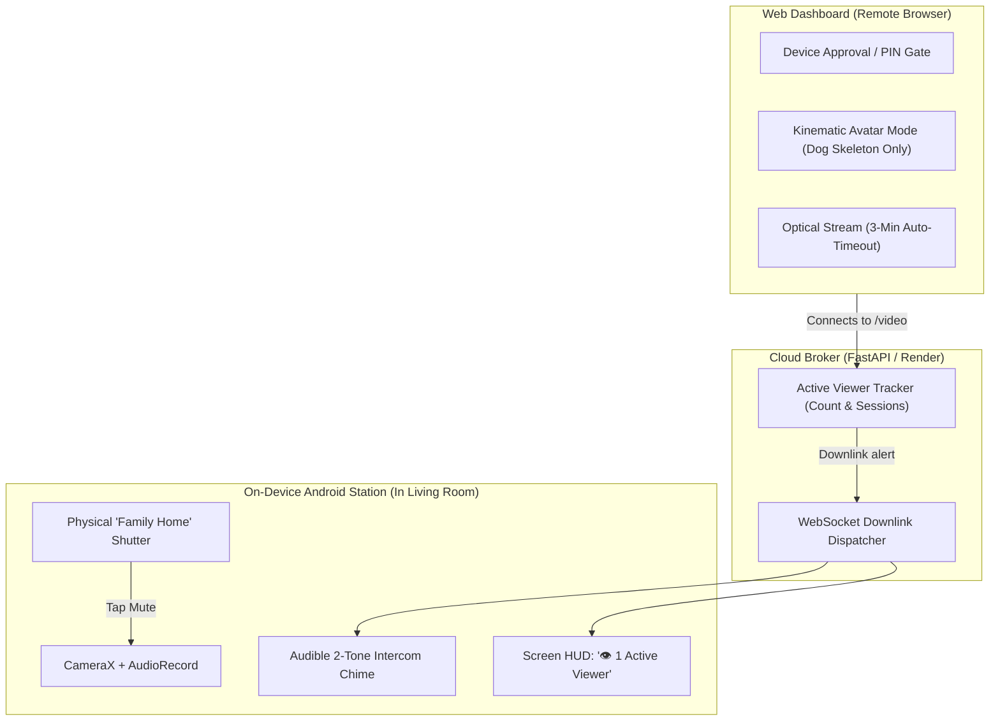

# Privacy Architecture, Threat Model & Anti-Lurking Controls

> **Context**: WagWatch (Behind The Barks) operates continuous multimodal in-home sensing (CameraX 15 FPS + 16 kHz AudioRecord) for dog affective perception. This document details the domestic privacy threat model, peer-reviewed human-computer interaction (HCI) research grounding, and the multi-layered defense architecture.

---

## 1. Domestic Threat Model: "The Co-Inhabitant Surveillance Dilemma"

In residential environments, traditional smart cameras that rely on a public URL and a static shared secret (such as a 4-digit PIN or household password) suffer from systemic privacy failures:

### The 4 Threat Vectors
1. **Silent Remote Lurking (Observer Invisibility)**:
   - A remote browser opens the live video stream (`/video`). The in-room station phone continues running with no visual change or sound.
   - Occupants in the room (homeowner, family members, roommates, domestic helpers, visitors) have **zero awareness** that they are being observed in real time.
2. **Persistent Credential Over-Privilege**:
   - A PIN shared with a friend, partner, or pet sitter for a single check-in remains valid indefinitely.
   - The credential holder can access the optical video feed at 2 AM or during intimate personal moments without the homeowner's knowledge or consent.
3. **Optical Overexposure (Excessive Modality Leakage)**:
   - To verify whether a dog is resting or eating, viewers receive a wide optical frame showing the entire private living room or bedroom, furniture, personal belongings, and passing family members.
4. **Cloud Broker Exposure**:
   - Cloud relays (Render, Koyeb, AWS) that process unencrypted video frames create an unnecessary third-party data vulnerability.

---

## 2. Peer-Reviewed Academic Grounding (OpenAlex / ACM)

1. **Everyday Uses and Surveillance in Pet & Home Cameras**:
   * **Citation**: Geeng, E., & Roesner, F. (2022). *Monitoring Pets, Deterring Intruders, and Casually Spying on Neighbors: Everyday Uses of Smart Home Cameras*. In *Proceedings of the 2022 CHI Conference on Human Factors in Computing Systems* (CHI '22).  
   * **DOI**: [10.1145/3491102.3517617](https://doi.org/10.1145/3491102.3517617)  
   * **Key Finding**: Pet cameras are the most frequent vector of accidental domestic surveillance. Non-primary users (bystanders and co-inhabitants) experience acute discomfort when observation occurs without mutual awareness.
2. **Failure of Shared Credentials for Domestic Bystanders**:
   * **Citation**: Yao, Y., Basdeo, J. R., Kaushik, S., & Wang, Y. (2019). *Privacy Perceptions and Designs of Bystanders in Smart Homes*. *Proceedings of the ACM on Interactive, Mobile, Wearable and Ubiquitous Technologies* (IMWUT/UbiComp), 3(2), 1-24.  
   * **DOI**: [10.1145/3359161](https://doi.org/10.1145/3359161)  
   * **Key Finding**: Passwords fail in domestic settings due to social delegation. True privacy requires **physical mutual awareness (audible/visual cues)** and **in-situ device sovereignty** (the physical station can cut feeds).
3. **Decoupling Functionality from Optical Surveillance**:
   * **Citation**: Geeng, E., Cranor, J. R., & Roesner, F. (2022). *Addressing Adjacent Actor Privacy: Designing for Bystanders, Co-Users, and Surveilled Subjects of Smart Home Cameras*. *ACM Designing Interactive Systems* (DIS '22).  
   * **DOI**: [10.1145/3532106.3535195](https://doi.org/10.1145/3532106.3535195)  
   * **Key Finding**: Domestic sensing must decouple functional utility (pet behavioral metrics) from raw optical video.
4. **Kinematic Abstraction Over Raw Video**:
   * **Citation**: Aloufi et al. (2024). *Skeleton-based Privacy-Preserving Smart Activity Sensor for Senior Care and Patient Monitoring*. *Preprints*.  
   * **DOI**: [10.20944/preprints202401.0108.v1](https://doi.org/10.20944/preprints202401.0108.v1)  
   * **Key Finding**: Discarding raw video on edge and transmitting only 17 skeletal joint coordinates eliminates optical snooping while maintaining >98% behavioral classification accuracy.

---

## 3. The 5 Architectural Defenses for WagWatch

### Defense 1: Mutual Presence Awareness & Intercom Chime
* **Immediate Audible Notice**: The millisecond a remote browser initiates a `/video` connection or WebSocket stream, the station phone in the room plays a gentle 2-tone intercom chime (`Beep-Boop`).
  - *Guarantee*: Nobody can ever watch secretly. Anyone in the room immediately hears when viewing begins.
* **On-Screen Active Viewer Badge**: The phone's Station Display shows:
  `👁️ 1 Active Viewer: Chrome (Windows)` with an active indicator dot.
* **One-Touch Station Kick**: The homeowner can tap **`🛑 Disconnect Viewers`** on the phone screen to cut the stream immediately.

### Defense 2: Two-Factor Station Device Approval (No Static Secrets)
* Similar to WhatsApp Web or Apple HomeKit:
* Entering the household PIN on a laptop does **not** grant immediate camera access.
* The station phone in the room displays an authorization prompt:
  > *"Allow remote viewer 'Chrome on Mac' to view camera? [Allow 15 min] [Allow Always] [Deny]"*
* Access requires physical in-situ confirmation by someone with physical access to the station phone.

### Defense 3: Kinematic-First Mode (Zero Optical Video)
* **Default Tier**: Viewers see the dog's emotion timeline (*"Happy / Relaxed / Sleeping"*), wag frequency, meal logs, and an animated wireframe skeleton of the dog on an abstract dark canvas.
* **Zero Optical Video**: No JPEG frames or raw audio leave the phone. The room, bed, clothes, and passing family members are 100% invisible.
* Optical camera feed requires an explicit *"Request 3-Minute Video Peek"* button.

### Defense 4: 3-Minute Stream Inactivity Timeout
* Active video streams automatically terminate after **180 seconds** (3 minutes) of continuous viewing with a prompt:
  > *"Stream paused to protect household privacy. [Tap to Resume]"*
* Prevents open browser tabs from streaming living room video indefinitely.

### Defense 5: Semantic Room Redaction (Dog-Only ROI Masking)
* Using the on-device YOLO detector, the phone station can black out or heavily blur 100% of the pixel area outside the dog's bounding box.
* The viewer sees only the dog; the surrounding domestic space is completely redacted.

---

## 4. Implementation Matrix

| Component | Responsibility | Status |
| :--- | :--- | :--- |
| `backend/main.py` | Track active `/video` subscribers; dispatch `viewer` downlinks. | Planned |
| `backend/web/remote_pipeline.py` | Maintain `_active_viewers` count and fire downlinks on connect/disconnect. | Planned |
| `android/.../EventUploader.kt` | Parse `viewer` downlink messages from WebSocket. | Ready for hookup |
| `android/.../MonitorService.kt` | Play `playViewerConnectedChime()` and update overlay with active viewer count. | Ready for hookup |
| `frontend/components/VideoPanel.tsx` | Implement 3-minute inactivity watchdog and Kinematic Mode toggle. | Planned |
