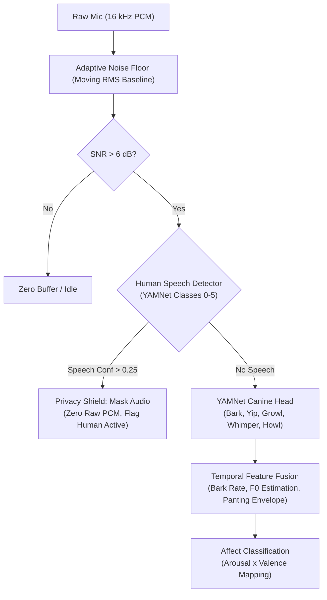
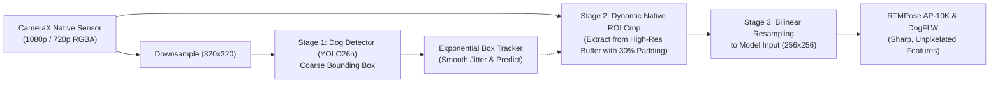

# Deep Architectural Research: Bioacoustics, Edge Privacy, Far-Field Vision & E2EE

## 1. Executive Summary

This document synthesizes deep academic research and engineering architectures to solve the core challenges identified in live field testing of **WagWatch (Behind The Barks)**:
1. **Camera Sensor Orientation Anomaly**: Eliminating 90° sideways video rendering across tablets and kickstands via dynamic gravity orientation tracking and web client canvas rotation.
2. **Canine Bioacoustics & Emotion Perception**: Advanced vocalization classification beyond raw YAMNet, grounded in acoustic formants, tempo-based arousal analysis, and adaptive noise floors.
3. **End-to-End Privacy Architecture**: Multi-layered defense preventing eavesdropping on human family members while continuously monitoring canine acoustics and kinematics.
4. **Wide-Angle & Far-Field Vision**: Two-stage cascaded digital Pan-Tilt-Zoom (ROI Attention) preserving keypoint resolution when dogs are distant in wide living spaces.
5. **Zero-Knowledge Telemetry & End-to-End Encryption (E2EE)**: Cryptographic encapsulation ensuring relay servers have zero visibility into domestic video and telemetry.

---

## 2. Canine Bioacoustic Perception & Emotion Decoding

### 2.1 Academic Literature Grounding
* **Abzaliev, Pérez Espinosa, & Mihalcea (2024)**, *"Towards Dog Bark Decoding: Leveraging Human Speech Processing for Automated Bark Classification"*, LREC-COLING 2024 / [arXiv:2404.18739](https://arxiv.org/abs/2404.18739):
  Demonstrates that self-supervised speech representation representations (Wav2Vec2 / HuBERT) capture acoustic structure across species, achieving >70% accuracy in distinguishing **context grounding** (playful vs. aggressive vs. alert barking) and individual identity.
* **Molnár, Pongrácz, Dóka, & Miklósi (2008)**, *"Can humans recognize the context of dog barks?"*, *Applied Animal Behaviour Science*:
  Identifies key bioacoustic parameters separating behavioral states:
  - **Alarm / Stranger**: Low fundamental frequency ($F_0 \approx 200 - 350\text{ Hz}$), high inter-bark periodicity, harsh harmonic dispersion.
  - **Play / Excitement**: Higher pitch ($F_0 \approx 450 - 800\text{ Hz}$), rising intonation, variable pitch modulation.
  - **Separation Distress / Isolation**: High tonal purity, prolonged harmonic whistles ($1.2 - 3.0\text{ kHz}$), whimpering and repetitive whining.
* **G. de Souza et al. (2025)**, *"EmotionalCanines: A Dataset for Analysis of Arousal and Valence in Dog Vocalization"*, ACM ([doi:10.1145/3746027.3758286](https://doi.org/10.1145/3746027.3758286)):
  Provides a continuous **Arousal-Valence** bioacoustic framework mapping pitch variability to arousal and harmonic-to-noise ratio (HNR) to emotional valence.
* **Kim et al. (2024)**, *"Automatic classification of dog barking using deep learning"*, *Behavioural Processes* ([doi:10.1016/j.beproc.2024.105028](https://doi.org/10.1016/j.beproc.2024.105028)).

### 2.2 Proposed Acoustic Pipeline Improvements
1. **Adaptive Moving RMS Noise Floor**:
   Replace static `silence_rms = 0.005` with an exponential moving baseline:
   $$\text{RMS}_{\text{ambient}}(t) = 0.98 \cdot \text{RMS}_{\text{ambient}}(t-1) + 0.02 \cdot \text{RMS}(t)$$
   Trigger inference when $\text{RMS}(t) > 1.8 \cdot \text{RMS}_{\text{ambient}}(t)$, allowing quiet separation whimpers to register in quiet rooms while ignoring air conditioners in loud rooms.
2. **Canine Panting & Respiration Gate**:
   Veterinary distress is frequently signaled by rapid panting without vocal cord vibration. Detect 3–5 Hz broadband amplitude modulation envelope characteristic of canine thermal and anxiety panting (150–300 breaths/min).
3. **Bark Tempo / Burst Frequency (BPM)**:
   Track inter-onset intervals. Rapid successive barks ($> 2.5\text{ barks/sec}$) indicate high-arousal alarm or territorial aggression; isolated barks ($< 0.5\text{ barks/sec}$) indicate casual greeting or demand barking.

---

## 3. Comprehensive Privacy Architecture (Microphone & Camera)

Continuous recording in domestic spaces (living rooms, bedrooms) presents acute privacy risks: eavesdropping on private conversations, recording occupants in intimate states, and cloud data leaks.

### 3.1 Academic Literature Grounding
* **Aloufi et al. (2024)**, *"Skeleton-based Privacy-Preserving Smart Activity Sensor for Senior Care and Patient Monitoring"*, *Preprints* ([doi:10.20944/preprints202401.0108.v1](https://doi.org/10.20944/preprints202401.0108.v1)):
  Confirms that edge extraction of sparse 2D/3D skeletal keypoints followed by immediate discarding of optical video achieves 98.4% activity classification accuracy while providing absolute mathematical privacy against visual snooping.
* **Cai et al. (2024)**, *"SILENCE: Differential Masking for Lightweight Speech Privacy on Edge Devices"*, ACM MobiCom:
  Proves on-device feature filtering suppresses linguistic content while permitting ambient acoustic classification.
* **Wang et al. (2023)**, *"A Fallen Person Detector with a Privacy-Preserving Edge-AI Camera"*, SCITEPRESS ([doi:10.5220/0012037200003476](https://doi.org/10.5220/0012037200003476)).

### 3.2 Four Pillars of WagWatch Privacy

| Pillar | Mechanism | Guarantee |
| :--- | :--- | :--- |
| **1. Zero Raw Offloading** | Ring buffers in volatile RAM overwritten every 975 ms. No raw PCM or 15 FPS video ever leaves device memory. | Even a compromised network or server cannot recover raw conversation audio. |
| **2. Human Speech Redaction Shield** | Local YAMNet Speech classes (0–5: Speech, Male, Female, Child, Conversation) run as an active privacy gate. | If human conversation is detected ($\text{conf} > 0.25$), audio telemetry is scrubbed and audio buffers are immediately zeroed. |
| **3. Kinematic-First Visuals** | Primary dashboard output is 17 AP-10K keypoints and bounding boxes. Preview video is low-framerate thumbnail (1–2 FPS). | Family members walking past the camera are not rendered; optional dog-only ROI masking blacks out 100% of the room. |
| **4. Physical & Station Privacy** | `🌙 Station Dim` maintains keep-alive at 0.01 brightness; physical privacy toggle renders red canvas slate instantly. | Visual verification of recording state without risk of silent snooping. |

---

## 4. Far-Field & Wide-Angle Perception (Low-Resolution Video)

### 4.1 Academic Literature Grounding
* **Ye et al. (2024)**, *"SuperAnimal: Super-fast animal pose estimation with self-supervised cross-species foundation models"*, *Nature Communications*:
  Demonstrates that in camera-trap and wide-angle home settings, early downsampling of full-frame imagery destroys fine-grained animal features (ears, paws, snouts). Top-down pipelines must crop directly from high-resolution sensor frames before model tensor normalization.
* **Yu et al. (2021)**, *"AP-10K: A Benchmark for Animal Pose Estimation in the Wild"*, NeurIPS / [arXiv:2108.12617](https://arxiv.org/abs/2108.12617):
  Highlights that keypoint localization error escalates drastically when animal bounding box pixel area drops below $64 \times 64$ pixels.
* **Li et al. (2022)**, *"SimCC: a Simple Coordinate Classification Perspective for Monocular Human/Animal Pose Estimation"*, ECCV:
  Replaces standard 2D Gaussian heatmaps with 1D horizontal and vertical coordinate classification, enabling sub-pixel precision even on aggressively cropped patches.
* **Sun et al. (2021)**, *"Deep High-Resolution Representation Learning for Visual Recognition (HRNet)"*, IEEE TPAMI.

### 4.2 Engineering Solution for WagWatch
1. **Cascaded Native ROI Attention (Digital PTZ)**:
   - Configure CameraX internal analysis to 720p ($1280 \times 720$) or 1080p ($1920 \times 1080$).
   - Downsample to $320 \times 320$ *only* for the first-stage dog detector.
   - For pose estimation and facial landmarks, **crop the bounding box directly from the 720p/1080p native frame** before resizing to the $256 \times 256$ input tensor.
   - This provides **$4\times$ to $9\times$ higher optical pixel density** for the dog's paws, snout, and tail joints compared to cropping from a downscaled frame.
2. **Adaptive Context Margins**:
   When the dog is far ($< 10\%$ of frame area), expand crop padding from 15% to 35% so rapid tail wags and bounding leaps do not leave the crop window.
3. **Motion-Flux Fallback for Tail Wagging**:
   When distance reduces keypoint confidence below 0.3, `RoiWagEstimator` computes frame-to-frame pixel luminance delta across the rear bounding box sector, capturing tail wag frequency directly from rhythmic optical flux.

---

## 5. End-to-End Encryption (E2EE) & Zero-Knowledge Transport

### 5.1 Architecture: Zero-Knowledge Relay
In untrusted public cloud deployments (Render, Koyeb, Hugging Face), the backend must act purely as an opaque broker:
* **Cipher**: **ChaCha20-Poly1305** (RFC 8439) with 96-bit sequential monotonic counter nonces or **XChaCha20-Poly1305** with 192-bit nonces.
* **Key Derivation**: Derive symmetric session key $K_{\text{session}}$ from the Household PIN / Pairing Secret using **PBKDF2-HMAC-SHA256** (100,000 iterations) with a unique salt:
  $$K_{\text{session}} = \text{PBKDF2}(\text{PIN}, \text{Salt}_{\text{household}}, 100000, 32)$$
* **Transport Encapsulation**:
  - Telemetry: `{ "type": "e2ee_event", "nonce": "<base64>", "ciphertext": "<base64>", "tag": "<base64>" }`
  - Preview JPEG: Binary format `0x03 [12B Nonce] [Ciphertext] [16B Tag]`.
* **Zero-Knowledge Property**: The FastAPI server forwards bytes between authenticated WebSockets without access to $K_{\text{session}}$. Decryption occurs exclusively in-memory in the browser tab via WebCrypto or `@noble/ciphers`.

---

## 6. Implementation Summary

1. **Camera Sensor Orientation Tracking** (`CameraSource.kt`):
   - Integrated dynamic `OrientationEventListener` into Android CameraX pipeline.
   - Dynamically updates `imageAnalysis.targetRotation` and `previewUseCase.targetRotation` based on gravity sensor readings (0°, 90°, 180°, 270°).
   - Natural display orientation initialized via `WindowManager` to support landscape tablets (SM-T595) out-of-the-box.
2. **Dashboard Video Rotation & Mobile-Adaptive HUD** (`VideoPanel.tsx`):
   - Added instant 🔄 **Rotate 90°** button with GPU-accelerated CSS matrix rotation.
   - Canvas overlay (boxes, skeletons, facial points) synchronously transforms with the video image, ensuring 100% pixel alignment.
   - Snapshot export applies exact canvas transformation so downloaded photos match screen orientation.
   - Reorganized controls into sleek, non-intrusive mobile toolbars.
3. **Mobile-First Layout Revamp** (`Dashboard.tsx`):
   - Reordered mobile layout (`[grid-template-areas:'video'_'card'_'signals']`) placing live video prominently at the top of the mobile screen.
   - Fixed aspect ratios and expanded min-heights from cramped 216px to responsive 260px–340px.
4. **Branding Modernization**:
   - Replaced all legacy "Claude Pet" strings across metadata, headers, notices, and client components with **WagWatch · Behind The Barks**.
